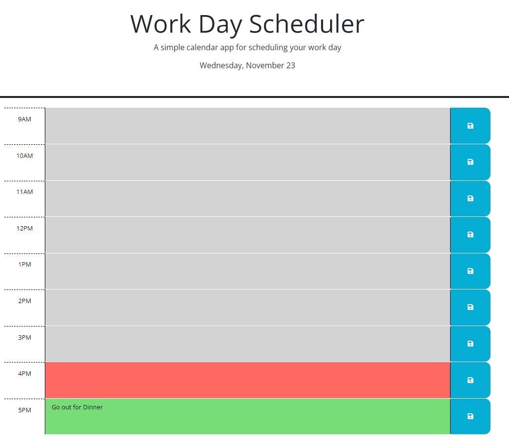
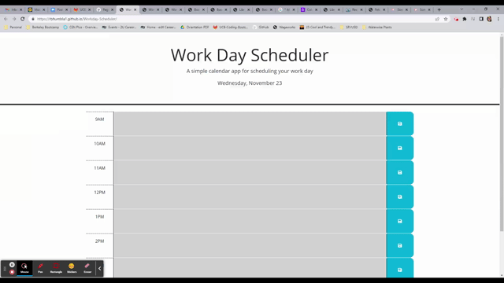

# Workday-Scheduler
Repository for a simple calendar application that allows a user to save events for each hour of the day. This app will run in the browser and feature dynamically updated HTML and CSS powered by jQuery.

## Description
Workday-Scduler shows aa calendar for working day i.e. 8 hours from 9am to 5pm.  Here are the features of this program:

1. Today's date is displayed in the header of the Scheduler when the application is started.
2. The user is presented with timeblocks for standard business hours
3. Each timeblock is color coded to indicate whether it is in the past(grey), present(orage-red), or future(green)
4. The user can click into a timeblock and enter an event
4. When the save button is clicked for that timeblock, the text for that event is saved in local storage
5. When the page is refreshed, the saved events persist

## Mock Up

Demo of the project:

## Usage
You can access:
1. the file in GitHub repository: https://github.com/rbhumbla1/Workday-Scheduler
2. the application using this URL: https://rbhumbla1.github.io/Workday-Scheduler

## License
None
